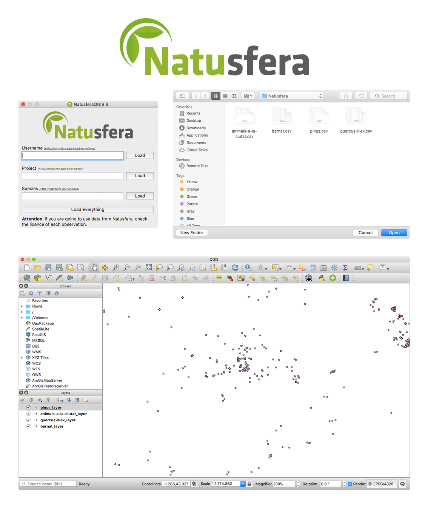

# NatusferaQGIS-3

https://plugins.qgis.org/plugins/natusferaqgis3/

NatusferaQGIS 3 harvests data from Natusfera, a Citizen Science platform for biodiversity observations (http://natusfera.gbif.es). The plugin lets the user choose downloading data of a given user, a project, a taxon, or the whole dataset. Data are downloaded as a .csv file with several attributes, including location, taxonomic name, taxonomic group, date and time of observation. The file is saved in a folder chosen by the user when the download starts. This plugin has been developed thanks to the funding of FECyT, the Obra Social La Caixa and the ATiCO (CSIC) project.

